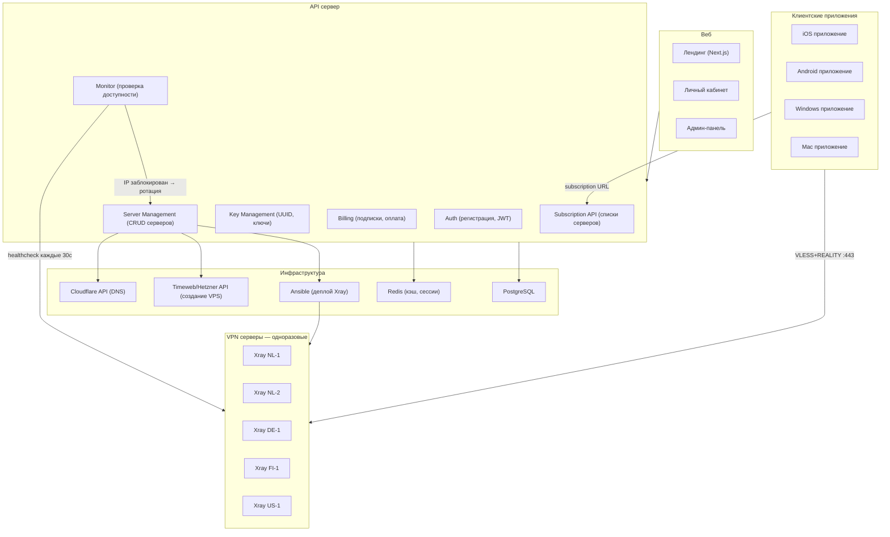

# VPN-сервис: полный план

## Архитектура



## Структура проекта

```
vpn-service/
├── frontend/                    # Next.js — лендинг + кабинет + админка
│   ├── app/
│   │   ├── (landing)/           # Лендинг — тарифы, фичи
│   │   ├── (dashboard)/         # Личный кабинет пользователя
│   │   │   ├── servers/         # Список серверов, статусы
│   │   │   ├── subscription/    # Управление подпиской
│   │   │   └── devices/         # Устройства, ключи, QR-коды
│   │   └── (admin)/             # Админка
│   │       ├── users/           # Управление пользователями
│   │       ├── servers/         # Управление серверами
│   │       └── stats/           # Статистика, графики
│   └── ...
│
├── server/                      # Express 5 — API
│   ├── routes/
│   │   ├── auth.js              # Регистрация, логин, JWT
│   │   ├── subscription.js      # Отдаёт список серверов клиентам
│   │   ├── keys.js              # CRUD ключей (UUID)
│   │   ├── servers.js           # CRUD VPN серверов
│   │   ├── billing.js           # Подписки, оплата
│   │   └── monitor.js           # Healthcheck, статусы серверов
│   ├── services/
│   │   ├── xray-config.js       # Генерация Xray конфигов
│   │   ├── ansible.js           # Запуск Ansible playbooks
│   │   ├── cloudflare.js        # Управление DNS записями
│   │   ├── hosting-api.js       # API хостеров (создание/удаление VPS)
│   │   ├── monitor.js           # Проверка доступности серверов
│   │   └── subscription.js      # Генерация подписок (Clash YAML, V2Ray)
│   ├── models/
│   │   ├── User.js
│   │   ├── Server.js
│   │   ├── Key.js
│   │   ├── Subscription.js
│   │   └── Payment.js
│   └── ...
│
├── infra/                       # Ansible + скрипты деплоя
│   ├── playbooks/
│   │   ├── deploy-xray.yml      # Установка Xray на новый VPS
│   │   ├── update-config.yml    # Обновление конфига Xray
│   │   └── remove-server.yml    # Удаление сервера
│   ├── templates/
│   │   └── xray-config.json.j2  # Шаблон конфига Xray с REALITY
│   └── inventory/               # Автогенерируемый список серверов
│
├── apps/                        # Клиентские приложения (форки)
│   ├── ios/                     # Форк Streisand/Hiddify
│   ├── android/                 # Форк Hiddify (Flutter)
│   └── windows/                 # Форк v2rayN или Clash Verge
│
└── docker-compose.yml           # API + PostgreSQL + Redis
```

## Обязательно с самого начала: домен + Cloudflare

Домен нужен **с первого дня**, чтобы при блокировке/переезде сервера не менять ключи у всех клиентов.

- Купить дешёвый домен (например `myvpn.xyz`, ~500 ₽/год)
- DNS через Cloudflare (бесплатно, быстрая смена IP)
- Каждый VPN-сервер получает поддомен: `nl1.myvpn.xyz`, `de1.myvpn.xyz`
- В ключах/подписках используется **домен**, не IP
- При блокировке IP: поднял новый сервер → сменил A-запись в Cloudflare → у клиентов всё работает без изменений
- API/сайт тоже на домене: `api.myvpn.xyz`, `myvpn.xyz`

## Мониторинг: Prometheus + Grafana с первого дня

На API-сервере рядом с основным стеком:

- **Prometheus** — собирает метрики со всех VPN-серверов
- **Grafana** — красивые дашборды, алерты
- **Node Exporter** на каждом VPN-сервере — CPU, RAM, сеть, диск
- **Xray Exporter / кастомный скрипт** — количество соединений, трафик по пользователям
- **Blackbox Exporter** — проверка доступности серверов (TCP + TLS handshake)
- **Проверка из России** — отдельный дешёвый VPS в РФ (~300 ₽/мес) с Blackbox Exporter, чтобы видеть блокировки глазами пользователя

Дашборды Grafana:
- Статус серверов (online/blocked/deploying) — карта мира
- Трафик по серверам и пользователям
- Количество активных соединений
- CPU/RAM/сеть каждого сервера
- Алерты: сервер недоступен → Telegram уведомление → авторотация

Всё в Docker Compose на API-сервере:
```
prometheus + grafana + node-exporter + blackbox-exporter
```

## Компоненты подробно

### 1. API сервер (Express)

Центральный узел, управляет всем.

**Auth:**

- Регистрация по email / Telegram
- JWT токены
- Роли: user, admin

**Subscription API — ключевой эндпоинт:**

```
GET /api/sub/{user_token}
```

Отдаёт список **живых** серверов для клиентского приложения. Формат зависит от User-Agent:

- Clash/mihomo → YAML
- V2Ray клиенты → base64
- Собственное приложение → JSON

Клиентское приложение запрашивает этот URL каждые 30 минут. Если сервер заблокирован — он просто исчезает из списка, появляется новый. Пользователь ничего не делает.

**Server Management:**

- Добавить сервер (вручную или через API хостера)
- Удалить сервер
- Пометить как заблокированный
- Автодеплой Xray через Ansible

**Monitor:**

- Cron каждые 30 секунд пингует каждый сервер
- Проверяет: TCP connect на порт 443 + TLS handshake
- Если сервер не отвечает 3 раза подряд → помечает как down
- Если down > 10 минут → запускает ротацию (новый VPS, новый IP)

### 2. Автодеплой серверов

Процесс создания нового VPN-сервера **полностью автоматический**:

```mermaid
flowchart LR
    Trigger["Триггер: IP заблокирован или нужен новый сервер"]
    CreateVPS["API хостера: создать VPS"]
    WaitBoot["Подождать 60с загрузки"]
    RunAnsible["Ansible: установить Xray + конфиг"]
    UpdateDNS["Cloudflare API: добавить DNS запись"]
    UpdateDB["БД: добавить сервер в список"]
    UpdateSub["Подписки пользователей автообновятся"]

    Trigger --> CreateVPS --> WaitBoot --> RunAnsible --> UpdateDNS --> UpdateDB --> UpdateSub
```



**API хостеров для автоматического создания VPS:**

- Timeweb Cloud — есть API для создания/удаления серверов
- Hetzner Cloud — отличный API, дешёвые серверы
- DigitalOcean — хороший API
- Vultr — хороший API

**Ansible playbook для Xray:**

- Устанавливает Docker
- Запускает Xray с конфигом VLESS+REALITY
- Конфиг генерируется API-сервером (ключи, SNI, порт)
- Каждый сервер получает **свой SNI** (google.com, microsoft.com, apple.com...)
- Время от триггера до работающего сервера: **2-3 минуты**

### 3. База данных (PostgreSQL)

**Таблицы:**

```
users
├── id, email, telegram_id
├── subscription_plan (free/basic/pro)
├── subscription_expires_at
├── token (для subscription URL)
└── created_at

servers
├── id, name, ip, domain
├── country, hoster
├── xray_config (JSON)
├── sni (google.com, microsoft.com...)
├── status (active/blocked/deploying)
├── max_users, current_users
└── created_at

keys
├── id, user_id, server_id
├── uuid (для VLESS)
├── traffic_used, traffic_limit
├── expires_at
└── enabled

payments
├── id, user_id
├── amount, currency, method
├── status (pending/paid/failed)
└── created_at
```

### 4. Клиентские приложения

**Форк Hiddify (Flutter — iOS + Android + Windows + Mac):**

- Один кодбаз на все платформы
- Ребрендинг: лого, название, цвета
- Встроенный subscription URL: пользователь вводит только токен
- Автообновление списка серверов
- Автовыбор лучшего сервера (по пингу)

**Минимальные изменения в форке:**

- Убрать лишние настройки (пользователю не нужно знать про VLESS/REALITY)
- Добавить экран логина (email + пароль или токен)
- Добавить экран подписки (тариф, оплата)
- Подключить свой API вместо ручного ввода ссылок

### 5. Веб-сайт (Next.js)

**Лендинг:**

- Тарифы и цены
- Как работает (просто и красиво)
- Скачать приложение
- FAQ

**Личный кабинет:**

- Текущая подписка и срок
- Список серверов (страны, пинг, статус)
- Мои устройства и ключи
- QR-код для подключения с телефона
- Оплата и история

**Админ-панель:**

- Все пользователи, поиск, фильтры
- Все серверы, статусы, нагрузка
- Добавить/удалить сервер одной кнопкой
- Статистика: пользователи, трафик, выручка, блокировки

### 6. Биллинг

**Методы оплаты:**

- ЮKassa (карты РФ)
- Криптовалюта (USDT, BTC) — через CryptoCloud или NowPayments
- Stripe (иностранные карты)
- Telegram Stars / Telegram Payments

**Модель:**

- Рекуррентные платежи (автопродление)
- При неоплате — ключи деактивируются через 3 дня grace period
- Промокоды, реферальная программа

## Этапы разработки

### Фаза 1: MVP (3-4 недели)

- API: auth, ключи, серверы, subscription endpoint
- Ручной деплой серверов (Ansible, но запуск вручную)
- Лендинг + личный кабинет (Next.js)
- Оплата через ЮKassa
- Приложение: пока без форка, инструкция "скачай Streisand/v2rayN, вставь ссылку"
- Запуск: 3-5 серверов, 50-100 бета-юзеров

### Фаза 2: Автоматизация (2-3 недели)

- Автодеплой серверов через API хостеров
- Мониторинг + автоматическая ротация при блокировке
- Telegram-бот для поддержки и выдачи ключей
- Subscription API с автоформатом (Clash/V2Ray/JSON)

### Фаза 3: Своё приложение (3-4 недели)

- Форк Hiddify (Flutter)
- Ребрендинг, упрощение UX
- Встроенный логин + подписка
- Публикация: APK + сайт (Android), TestFlight (iOS), exe (Windows)

### Фаза 4: Масштабирование

- 20+ серверов в 5+ странах
- Реферальная программа
- Маркетинг (Telegram каналы, блогеры)
- App Store (через зарубежный аккаунт разработчика)

## Стоимость запуска

| Позиция                             | Стоимость             |
| ----------------------------------- | --------------------- |
| 5 VPS серверов (первый месяц)       | ~15 000 ₽             |
| Домен                               | ~1 000 ₽/год          |
| VPS для API + БД                    | ~3 000 ₽/мес          |
| Apple Developer Account             | $99/год (~9 000 ₽)    |
| Google Play Developer               | $25 разово (~2 300 ₽) |
| ЮKassa подключение                  | бесплатно             |
| **Итого на старт**                  | **~30 000 ₽**         |
| **Ежемесячно (до первых клиентов)** | **~18 000 ₽**         |

Окупаемость при 50 платящих клиентах по 400 ₽ = 20 000 ₽/мес. Выход в плюс — через 1-2 месяца после запуска.
